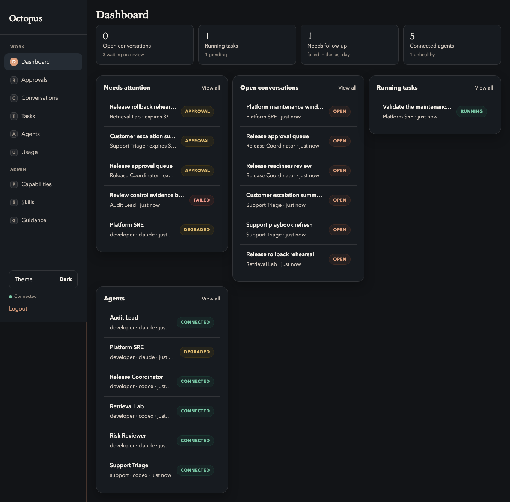

# Registry UI: Dashboard

Manual: [Home](../README.md) · Registry UI: [Overview](../03-operator-registry.md) · Previous: [Sign in](sign-in.md) · Next: [Approvals](approvals.md)

**Route:** `/ui` or `/ui/`

The dashboard is a compact operator overview, not a telemetry wall. It is built
around four surfaces:

- a **summary rail** for open conversations, running tasks, follow-up work, and
  connected agents
- **Needs attention** for approvals, failing work, or unhealthy agents
- **Open conversations** for the threads that still need operator visibility
- **Running tasks** and **Agents** so you can jump directly into active work or
  a specific agent

The numbers still come from `GET /v1/summary`, but the dashboard combines that
aggregate payload with the approvals, conversations, tasks, and agent lists so
the page answers “what needs action now?” instead of only reporting totals.

