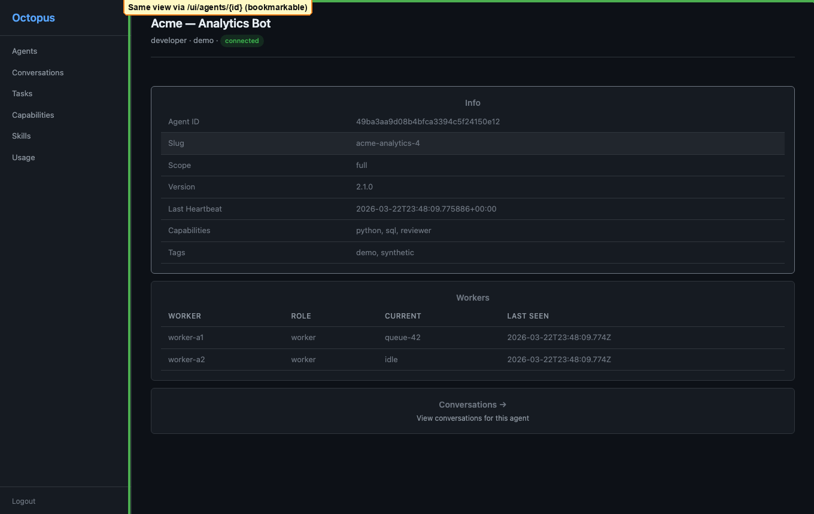
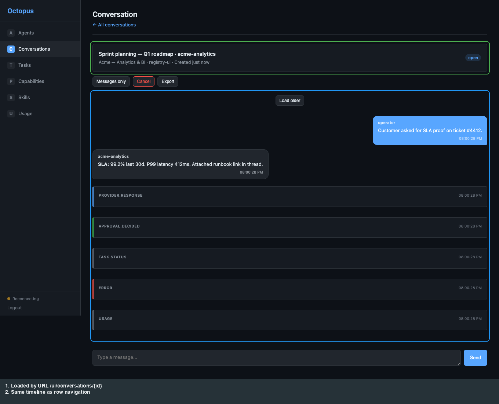

# Registry UI: Deep links

[← Usage](usage.md) · [Registry UI hub](../03-operator-registry.md) · [Next: Telegram →](../04-product-telegram.md)

These URLs load the **same** views as in-app navigation; use them from logs, API responses, or bookmarks.

**Agent by id** — `/ui/agents/{agent_id}`

**Conversation by id** — `/ui/conversations/{conversation_id}`

