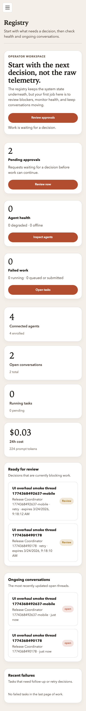
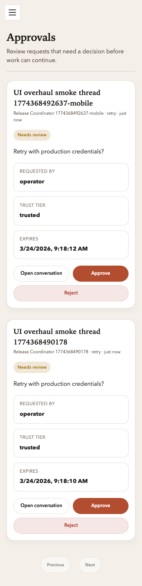
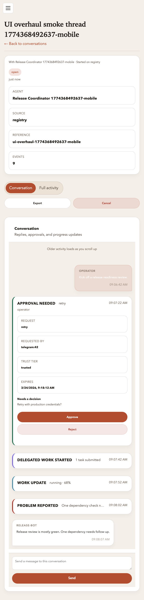

# Registry UI: Mobile quick look

[← Manual home](../README.md) · [Prev: Deep links](deep-links.md) · [Next: Telegram →](../04-product-telegram.md)

This page is deliberately short. The mobile UI is not a separate product surface; it is the same operator SPA with the sidebar moved into a drawer, the dashboard stacked into one column, and the conversation workspace compressed into a narrow but still action-first flow.

**Dashboard**

- The lead card, attention cards, and preview lists stack in one column.
- The same dashboard priorities stay visible: what needs action now, what is unhealthy, and what was updated most recently.

**Approvals**

- Approval cards keep the request summary, facts, and action buttons visible without extra expansion.
- This remains the fastest mobile path for unblock decisions.

**Conversation detail**

- The conversation meta, timeline toggle, event stream, and compose box collapse into one reading column.
- Pending approvals remain expanded and actionable; lower-level activity stays compact until you switch to full activity.

