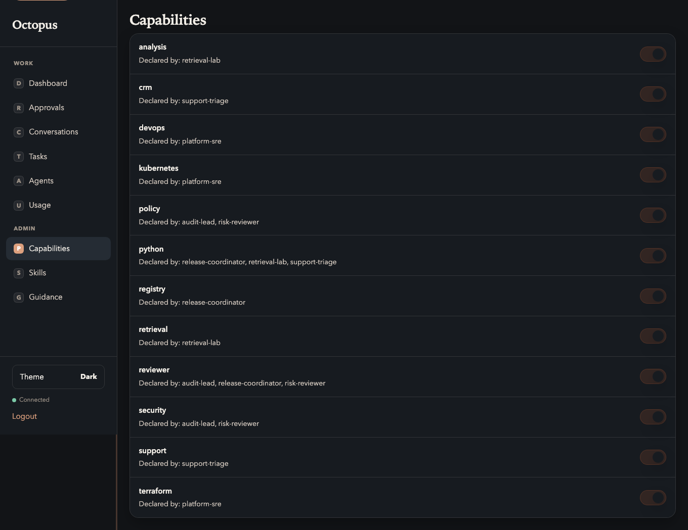

# Registry UI: Routing

Manual: [Home](../README.md) · Registry UI: [Overview](../03-operator-registry.md) · Previous: [Tasks](tasks.md) · Next: [Skills catalog](skills-catalog.md)

**Route:** `/ui/routing` — operator **routing policy** for advertised skills. Changes ask for **confirmation** and use **POST** + **CSRF** with the session cookie.

