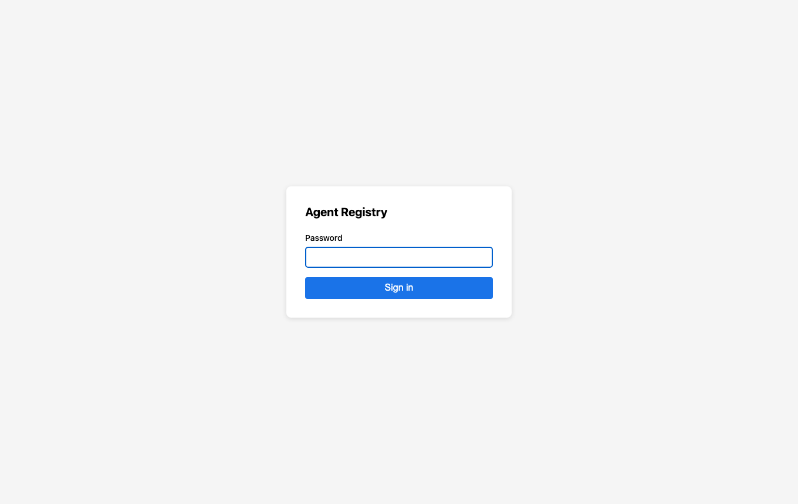

# Registry UI: Sign in

Manual: [Home](../README.md) · Registry UI: [Overview](../03-operator-registry.md) · Next: [Dashboard](dashboard.md)

Open the registry **`/ui/login`** URL. Enter **`REGISTRY_UI_TOKEN`** from **`.deploy/registry/.env`** as the **password** only (no username). The server sets a **session cookie**; later mutating requests use **CSRF** from **`GET /v1/auth/csrf`**.

If login fails: confirm the registry is running, the token matches the process env, and cookies are not blocked (watch HTTP vs HTTPS).

