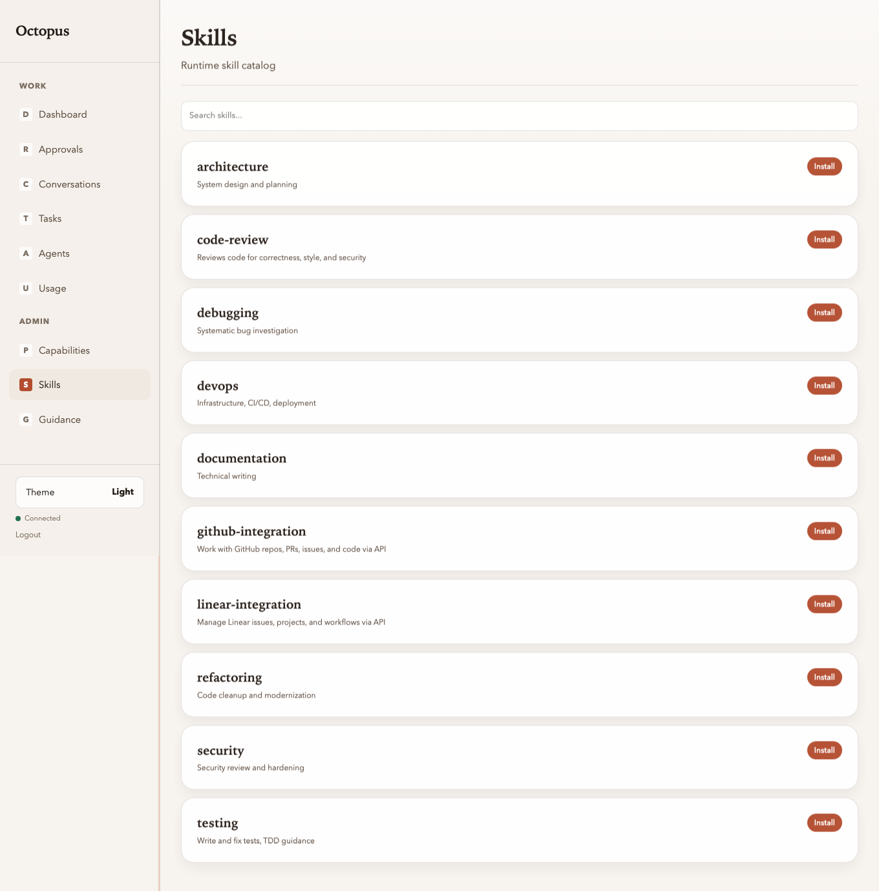

# Registry UI: Skills catalog

Manual: [Home](../README.md) · Registry UI: [Overview](../03-operator-registry.md) · Previous: [Routing](routing.md) · Next: [Usage](usage.md)

**Route:** `/ui/skills`

This page now acts as a skills hub with two operator views:

- **Bot catalog** — what is installed on the selected bot, plus skill-store
  results when you search
- **Studio** — custom skill drafts, lifecycle state, and publish controls

It intentionally does **not** activate a skill into one conversation. That is a
separate layer and happens inside the conversation **Skills** panel.

Use the same vocabulary everywhere:

- `Catalog`
- `Installed on bot`
- `Active in conversation`
- `Core / Store / Custom`
- `Needs setup / Ready`

