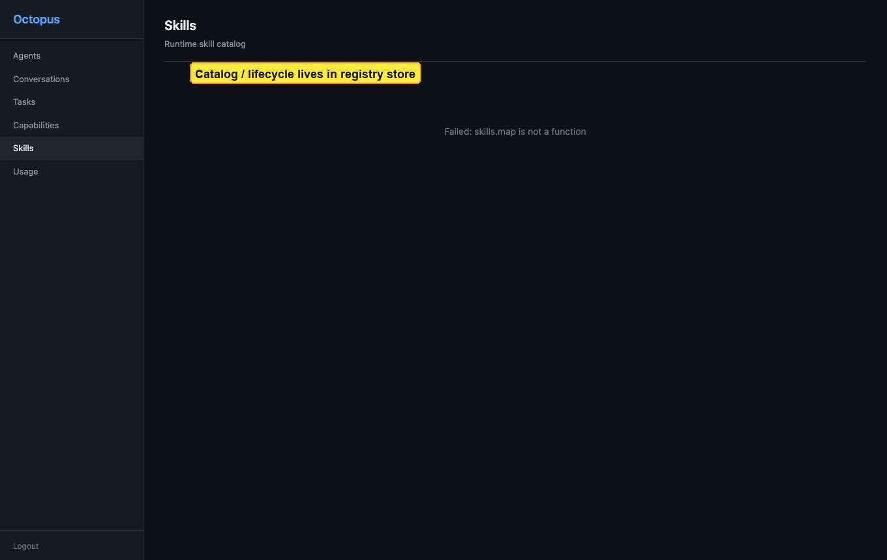

# Registry UI: Skills catalog

[← Manual home](../README.md) · [Prev: Capabilities](capabilities.md) · [Next: Usage →](usage.md)

**Route:** `/ui/skills` — read-oriented **runtime skill catalog** (client-side search). Full **draft → submit → approve → publish** lifecycle is **not** driven from this screen; use **`/v1/catalog/skills/...`** or other tooling for lifecycle work.

