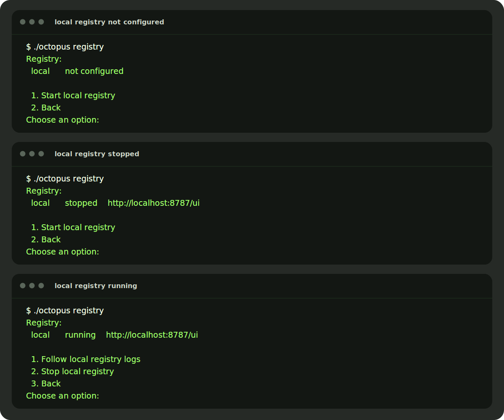
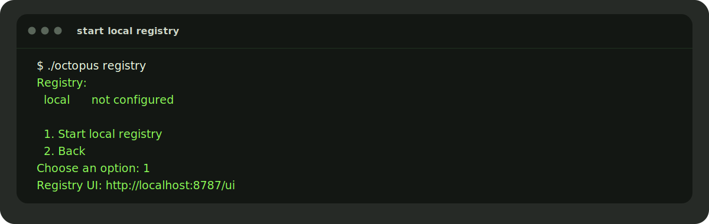
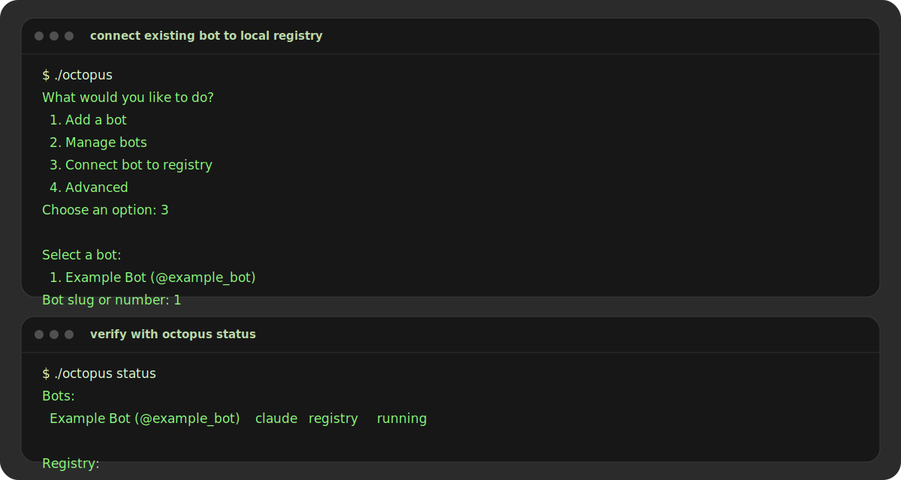
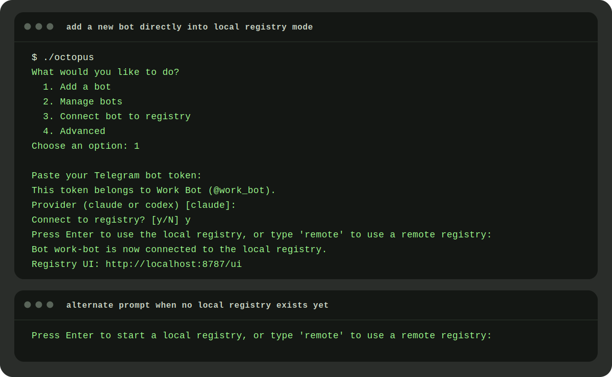
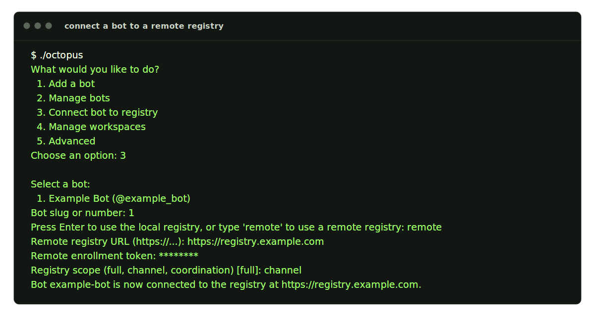
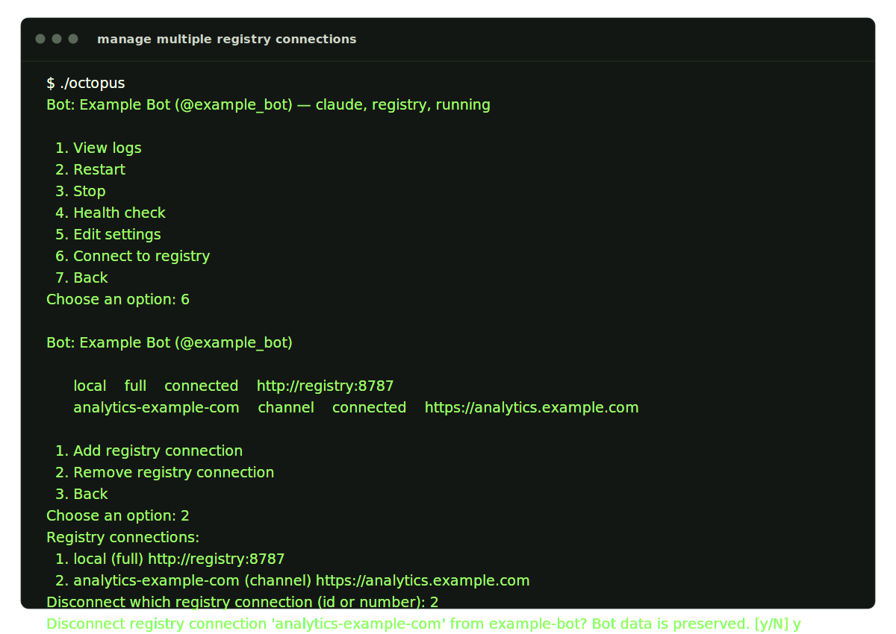
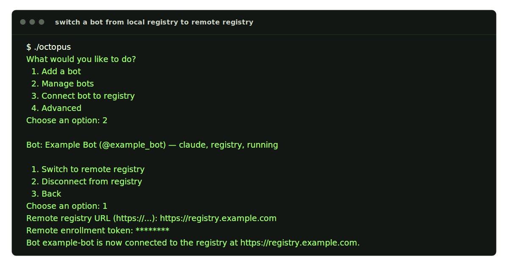
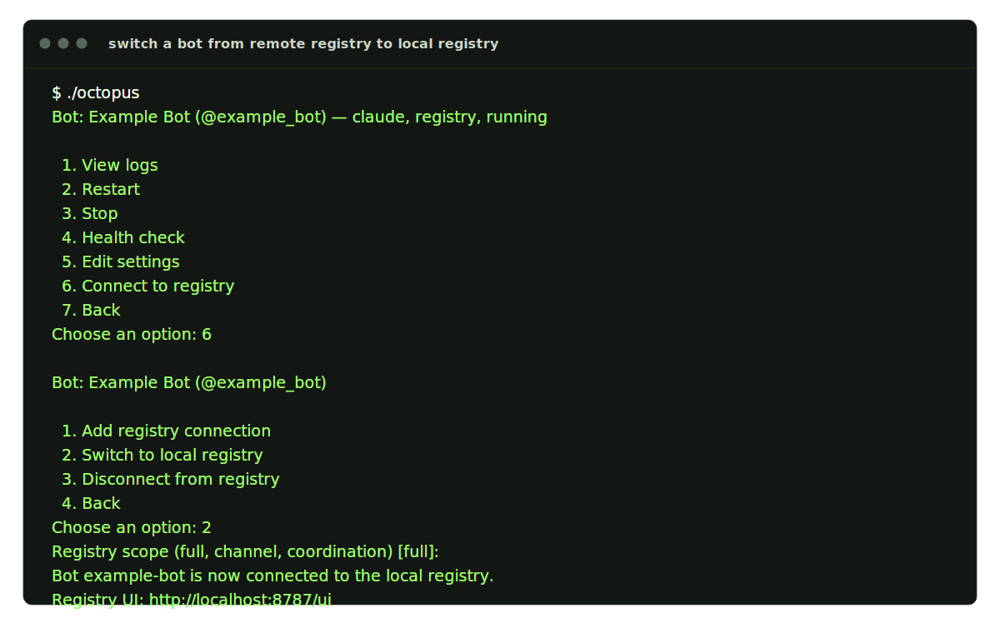
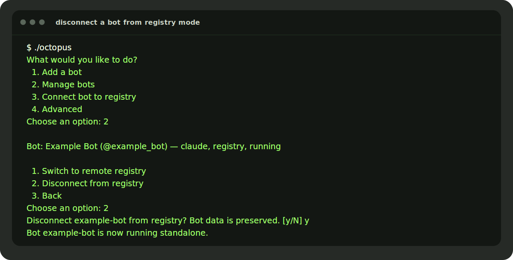
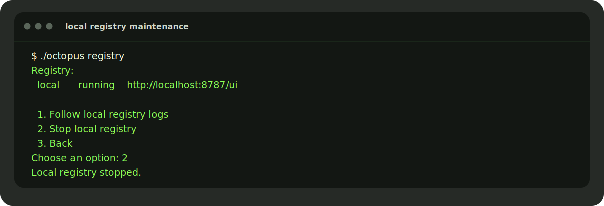

# Registry Guide

This guide covers the registry lifecycle exposed by `./octopus` and the
Registry UI.

Use registry mode when you want:

- a local or remote browser UI for connected bots
- routed-task coordination and shared agent discovery
- one registry shared by multiple bots in this deployment
- one bot connected to multiple registries with different scopes

Text-mode flows are shown as styled terminal panels. Browser screenshots are
kept for the actual Registry UI stages where they add value.

## Registry Modes

Local registry:

- started and managed from `./octopus registry`
- browser UI at `http://localhost:<port>/ui`
- bots connect inside Docker with `http://registry:8787`

Remote registry:

- uses your hosted `https://...` registry URL
- no local browser URL is involved
- requires a remote enrollment token

## Registry Scopes

Octopus prompts for a scope whenever you add or switch a registry connection.

- `full`
  - conversation + coordination surfaces
  - local UI/timelines plus routed tasks
- `channel`
  - conversation/UI/timeline surfaces only
  - no routed-task intake on that connection
- `coordination`
  - routed tasks, agent discovery, and health only
  - no conversation-channel surface on that connection

## Workflow 1: Check Local Registry Status

Run:

```bash
./octopus registry
```

If the local registry has not been started yet, already exists but is stopped,
or is already running, the menu looks like this:



## Workflow 2: Start The Local Registry

From the menu above, choose `1. Start local registry`.

Typical output:



Important values after startup:

- browser URL: `http://localhost:<port>/ui`
- UI password: `REGISTRY_UI_TOKEN` from `.deploy/registry/.env`
- bot-to-registry URL inside Docker: `http://registry:8787`

## Workflow 3: Sign In To The Local Registry UI

Open the printed browser URL and sign in with `REGISTRY_UI_TOKEN` from
`.deploy/registry/.env`.

For the default local setup, that is usually `http://localhost:8787/ui`.


## Workflow 4: Connect An Existing Standalone Bot To The Local Registry

Run:

```bash
./octopus
```

If you already have bots, choose `Manage bots` or `Connect bot to registry`.

Representative flow for an existing standalone bot:



After the reconnect/restart path lands, `./octopus status` shows one registry
connection row per bot with:

- `registry_id`
- `scope`
- current connection state
- URL

## Workflow 5: Add A New Bot Directly Into Registry Mode

If you add another bot with `./octopus`, Octopus asks whether the new bot
should connect to a registry.

Representative flow:



If no local registry exists yet, the prompt changes to:

- `Press Enter to start a local registry, or type 'remote' to use a remote registry:`

## Workflow 6: Connect A Bot To A Remote Registry

Octopus supports remote registries per bot. The URL must start with
`https://`.

Representative flow:



For remote registries:

- Octopus never prints a local `localhost` UI URL
- the bot keeps its own remote registry URL, enrollment token, and scope in
  its env file
- local registry state is unaffected unless you explicitly switch away from it

## Workflow 7: Add Or Remove Extra Registry Connections

Registry-backed bots can carry more than one registry connection.

Representative multi-connection management flow:



Use this path when you want to:

- add a second remote registry without losing the first connection
- remove one connection while keeping the bot in registry mode
- separate `channel` and `coordination` authorities intentionally

## Workflow 8: Switch A Single-Connection Bot From Local Registry To Remote Registry

Switch flows are only available when exactly one registry connection is
configured for the bot.

Representative flow:



If no other bots still use the local registry, Octopus may offer to stop it.

## Workflow 9: Switch A Single-Connection Bot From Remote Registry To Local Registry

Representative flow:



If the local registry is not running yet, Octopus starts it automatically.

## Workflow 10: Disconnect A Bot From Registry Mode

Disconnecting a bot preserves bot data and removes registry connections.

Representative single-connection disconnect flow:



If the bot has only one registry connection, it returns to standalone mode. If
the bot has multiple connections, removing one connection leaves the bot in
registry mode with the remaining entries intact.

## Workflow 11: Use The Registry Dashboard

Once bots are connected, the Registry UI becomes the main browser surface for
registry-backed workflows.


Typical uses from the UI:

- inspect connected bots, capacity, and health details
- filter conversations and open full conversation detail
- send follow-up messages, export transcripts, or cancel conversations
- watch routed-task state and delegated-result progress
- manage runtime skills, provider guidance, and capability kill switches

## Workflow 12: Follow Logs Or Stop The Local Registry

When the local registry is already running, `./octopus registry` gives you two
maintenance actions.

Representative flow:



If you choose `1. Follow local registry logs`, Octopus streams the registry
service logs until you stop it with `Ctrl+C`.

## Verification Checklist

After any registry change, verify with:

```bash
./octopus status
./octopus doctor
```

You want to see:

- the bot listed in `registry` mode when it should be connected
- one connection line per configured registry, with the expected `registry_id`,
  `scope`, state, and URL
- the local registry listed as `running` when using local mode
- the doctor flow succeed without token or enrollment errors

## Quick Troubleshooting

`./octopus registry` says `stopped`

- start it from `./octopus registry`

Remote registry connect fails immediately

- confirm the URL starts with `https://`
- confirm the enrollment token is correct
- re-run the flow and check the scope you selected

Switch to local/remote is unavailable

- switch flows require exactly one configured registry connection
- remove extra registry connections first, or use the add/remove flow instead

The browser UI does not load

- confirm the port in `.deploy/registry/.env`
- confirm `./octopus status` shows the local registry as `running`
- restart it from `./octopus registry`

The bot does not show up in the UI

- run `./octopus status`
- run `./octopus doctor`
- inspect the per-connection state lines for `starting` or `degraded`
- reconnect the bot through the registry flow if needed

The bot should be local but still shows remote behavior

- open the bot management flow again
- choose `Switch to local registry`
- re-run `./octopus status` and `./octopus doctor`
