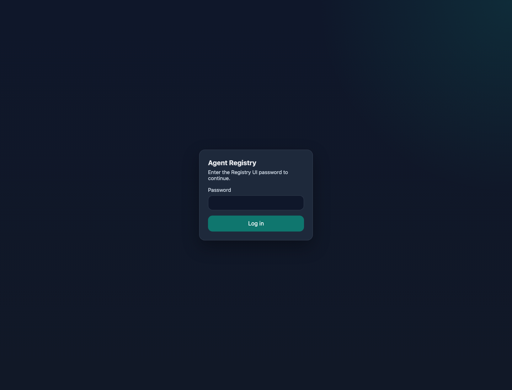
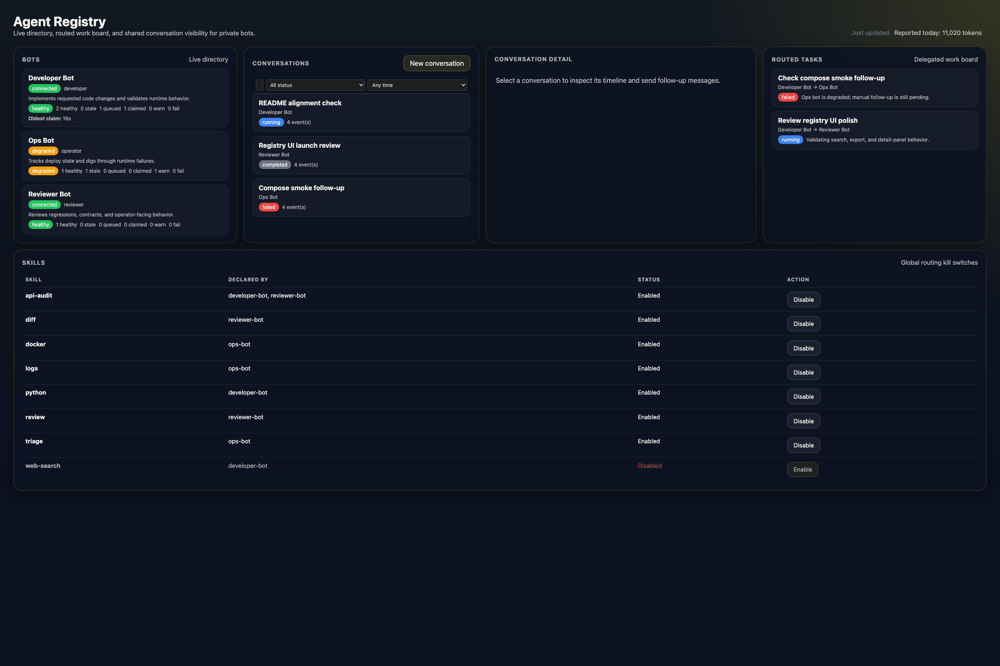

# Registry Guide

This guide covers the full registry lifecycle in `./octopus`.

Use registry mode when you want:

- a local browser UI for connected bots
- one registry shared by multiple bots in this deployment
- a clean way to switch a bot between standalone, local registry, and remote registry modes

Text-mode flows are shown as representative terminal transcripts. Screenshots are
kept only for the browser UI stages where they add value.

## Registry Modes

Local registry:

- started and managed from `./octopus registry`
- browser UI at `http://localhost:<port>/ui`
- bots connect inside Docker with `http://registry:8787`

Remote registry:

- uses your hosted `https://...` registry URL
- no local browser UI is involved
- requires a remote enrollment token

## Workflow 1: Check Local Registry Status

Run:

```bash
./octopus registry
```

If the local registry has not been started yet, the flow looks like:

```text
$ ./octopus registry
Registry:
  local      not configured

  1. Start local registry
  2. Back
Choose an option:
```

If it already exists but is stopped:

```text
$ ./octopus registry
Registry:
  local      stopped    http://localhost:8787/ui

  1. Start local registry
  2. Back
Choose an option:
```

If it is already running:

```text
$ ./octopus registry
Registry:
  local      running    http://localhost:8787/ui

  1. Follow local registry logs
  2. Stop local registry
  3. Back
Choose an option:
```

## Workflow 2: Start The Local Registry

From the menu above, choose `1. Start local registry`.

Typical output:

```text
$ ./octopus registry
Registry:
  local      not configured

  1. Start local registry
  2. Back
Choose an option: 1
Registry UI: http://localhost:8787/ui
```

Important values after startup:

- browser URL: `http://localhost:<port>/ui`
- UI password: `REGISTRY_UI_TOKEN` from `.deploy/registry/.env`
- bot-to-registry URL inside Docker: `http://registry:8787`

## Workflow 3: Sign In To The Local Registry UI

Open the printed browser URL and sign in with `REGISTRY_UI_TOKEN` from
`.deploy/registry/.env`.

For the default local setup, that is usually:

```text
http://localhost:8787/ui
```



## Workflow 4: Connect An Existing Standalone Bot To The Local Registry

Run:

```bash
./octopus
```

If you already have bots, choose `Manage bots` or `Connect bot to registry`.

Representative flow for an existing standalone bot:

```text
$ ./octopus
What would you like to do?
  1. Add a bot
  2. Manage bots
  3. Connect bot to registry
  4. Advanced
Choose an option: 3

Select a bot:
  1. Example Bot (@example_bot)
Bot slug or number: 1
Press Enter to use the local registry, or type 'remote' to use a remote registry:
Bot example-bot is now connected to the local registry.
Registry UI: http://localhost:8787/ui
```

Verify with:

```bash
./octopus status
```

Representative status output:

```text
Bots:
  Example Bot (@example_bot)    claude   registry     running

Registry:
  local      running    http://localhost:8787/ui

Provider auth:
  claude     authenticated
  codex      not configured
```

## Workflow 5: Add A New Bot Directly Into Registry Mode

If you add another bot with `./octopus`, Octopus asks whether the new bot should
connect to a registry.

Representative flow:

```text
$ ./octopus
What would you like to do?
  1. Add a bot
  2. Manage bots
  3. Connect bot to registry
  4. Advanced
Choose an option: 1

Paste your Telegram bot token:
This token belongs to Work Bot (@work_bot).
Provider (claude or codex) [claude]:
Connect to registry? [y/N] y
Press Enter to use the local registry, or type 'remote' to use a remote registry:
Bot work-bot is now connected to the local registry.
Registry UI: http://localhost:8787/ui
```

If no local registry exists yet, the prompt changes to:

```text
Press Enter to start a local registry, or type 'remote' to use a remote registry:
```

## Workflow 6: Connect A Bot To A Remote Registry

Octopus supports remote registries per bot. The URL must start with `https://`.

Representative flow:

```text
$ ./octopus
What would you like to do?
  1. Add a bot
  2. Manage bots
  3. Connect bot to registry
  4. Advanced
Choose an option: 3

Select a bot:
  1. Example Bot (@example_bot)
Bot slug or number: 1
Press Enter to use the local registry, or type 'remote' to use a remote registry: remote
Remote registry URL (https://...): https://registry.example.com
Remote enrollment token: ********
Bot example-bot is now connected to the registry at https://registry.example.com.
```

For remote registries:

- Octopus never prints a local `localhost` UI URL
- the bot keeps its own remote registry URL and enrollment token in its env file
- local registry state is unaffected unless you explicitly switch away from it

## Workflow 7: Switch A Bot From Local Registry To Remote Registry

Open the manage flow for a bot that already uses the local registry.

Representative flow:

```text
$ ./octopus
What would you like to do?
  1. Add a bot
  2. Manage bots
  3. Connect bot to registry
  4. Advanced
Choose an option: 2

Bot: Example Bot (@example_bot) — claude, registry, running

  1. Switch to remote registry
  2. Disconnect from registry
  3. Back
Choose an option: 1
Remote registry URL (https://...): https://registry.example.com
Remote enrollment token: ********
Bot example-bot is now connected to the registry at https://registry.example.com.
```

If no other bots still use the local registry, Octopus may offer to stop it.

## Workflow 8: Switch A Bot From Remote Registry To Local Registry

Representative flow:

```text
$ ./octopus
What would you like to do?
  1. Add a bot
  2. Manage bots
  3. Connect bot to registry
  4. Advanced
Choose an option: 2

Bot: Example Bot (@example_bot) — claude, registry, running

  1. Switch to local registry
  2. Disconnect from registry
  3. Back
Choose an option: 1
Bot example-bot is now connected to the local registry.
Registry UI: http://localhost:8787/ui
```

If the local registry is not running yet, Octopus starts it automatically.

## Workflow 9: Disconnect A Bot From Registry Mode

Disconnecting a bot keeps bot data intact and changes only its registry mode.

Representative flow:

```text
$ ./octopus
What would you like to do?
  1. Add a bot
  2. Manage bots
  3. Connect bot to registry
  4. Advanced
Choose an option: 2

Bot: Example Bot (@example_bot) — claude, registry, running

  1. Switch to remote registry
  2. Disconnect from registry
  3. Back
Choose an option: 2
Disconnect example-bot from registry? Bot data is preserved. [y/N] y
Bot example-bot is now running standalone.
```

If no other bots use the local registry, Octopus offers to stop it.

## Workflow 10: Use The Registry Dashboard

Once bots are connected, the Registry UI becomes the main browser surface for
registry-backed workflows.



Typical uses from the UI:

- inspect connected agents
- review registry-backed activity
- work with routing and timeline views

## Workflow 11: Follow Logs Or Stop The Local Registry

When the local registry is already running, `./octopus registry` gives you two
maintenance actions.

Representative flow:

```text
$ ./octopus registry
Registry:
  local      running    http://localhost:8787/ui

  1. Follow local registry logs
  2. Stop local registry
  3. Back
Choose an option: 2
Local registry stopped.
```

If you choose `1. Follow local registry logs`, Octopus streams the registry
service logs until you stop it with `Ctrl+C`.

## Verification Checklist

After any registry change, verify with:

```bash
./octopus status
./octopus doctor
```

You want to see:

- the bot listed in `registry` mode when it should be connected
- the local registry listed as `running` when using local mode
- the doctor flow succeed without token or enrollment errors

## Quick Troubleshooting

`./octopus registry` says `stopped`

- start it from `./octopus registry`

Remote registry connect fails immediately

- confirm the URL starts with `https://`
- confirm the enrollment token is correct

The browser UI does not load

- confirm the port in `.deploy/registry/.env`
- confirm `./octopus status` shows the local registry as `running`
- restart it from `./octopus registry`

The bot does not show up in the local UI

- run `./octopus status`
- run `./octopus doctor`
- reconnect the bot through the registry flow

The bot should be local but still shows remote behavior

- open the bot management flow again
- choose `Switch to local registry`
- re-run `./octopus status` and `./octopus doctor`
