# Registry guide

This guide explains **why** you use the registry, **how** `./octopus` fits in, and **how to use the Registry web UI** screen by screen. Terminal flows use the existing SVG assets under `docs/assets/registry/`; **browser** sections use screenshots captured from the current UI (see [Regenerating UI screenshots](#regenerating-ui-screenshots)).

For a **complete inventory** of operator and product flows (including Octopus menus, Telegram commands, and Registry API surfaces), see **[flows-catalog.md](flows-catalog.md)**.

## Contents

1. [When to use registry mode](#when-to-use-registry-mode)
2. [Concepts (read this once)](#concepts-read-this-once)
3. [CLI: lifecycle with `./octopus`](#cli-lifecycle-with-octopus)
4. [Browser: sign in](#browser-sign-in)
5. [Browser: every screen](#browser-every-screen) — dashboard, agents, conversations (incl. **search filter**), timeline, tasks, capabilities, skills, usage, guidance, **deep-linked agent & conversation URLs**, plus a compact **mobile quick look**
6. [What the UI does *not* do yet](#what-the-ui-does-not-do-yet)
7. [Verification & troubleshooting](#verification--troubleshooting)
8. [Regenerating UI screenshots](#regenerating-ui-screenshots)

**Image set (under `docs/assets/registry/ui/`):** `00-login`, `01-dashboard`, `01b-approvals`, `02-agents`, `03-agent-detail`, `04-agent-conversations`, `05-conversations`, `05b-conversations-filtered`, `06-conversation-detail`, `07-tasks`, `08-capabilities`, `09-skills`, `10-usage`, `11-guidance`, `12-agent-detail-deep-link`, `13-conversation-deep-link`, plus the mobile reference captures `14-mobile-dashboard`, `15-mobile-approvals`, and `16-mobile-conversation`. Desktop guide images keep the raw `*.png`, matching `*.meta.json`, and `*-annotated.png`; the mobile references are intentionally kept as raw PNGs so the small-screen layout stays readable.

---

## When to use registry mode

Use registry mode when you want:

- A **browser UI** to inspect enrolled bots, conversations, and coordination state.
- **Routed-task** coordination and **agent discovery** (depending on registry scope).
- **One registry** shared by several bots, or **one bot** connected to **multiple** registries with different scopes.

---

## Concepts (read this once)

| Term | Meaning |
|------|---------|
| **Registry service** | HTTP API + optional Web UI (`/ui`). Bots call `/v1/…` with agent tokens; operators use the browser with `REGISTRY_UI_TOKEN`. |
| **Registry scope** | What a *bot* may do on that connection: `full` (conversations + coordination), `channel` (conversation surfaces only), `coordination` (tasks/discovery/health, no conversation channel). |
| **Operator** | A human using the **Registry UI** (password = `REGISTRY_UI_TOKEN`). |
| **Agent token** | Issued at enroll time; bots use `Authorization: Bearer …` on `/v1/`. |
| **Conversation** | Registry row keyed by `(target_agent_id, origin_channel, external_conversation_ref)`. Events live in the `events` table. |
| **Routed task** | Delegation record from an **origin** bot to a **target** bot, tied to a **parent conversation**. |

**URLs**

- Operator browser (local): `http://localhost:<port>/ui` (port from `./octopus registry` or `.deploy/registry/.env`).
- Bots inside Docker: `http://registry:8787` (same API, no `/ui` required).

---

## CLI: lifecycle with `./octopus`

The following workflows are illustrated with **terminal diagrams** (SVG). They are unchanged in spirit from earlier docs; use them for **add / switch / disconnect** registry connections.

| Step | Topic | Asset |
|------|--------|--------|
| Check status | `./octopus registry` menu | [`01-local-registry-states.svg`](assets/registry/01-local-registry-states.svg) |
| Start local registry | Option `1` | [`02-start-local-registry.svg`](assets/registry/02-start-local-registry.svg) |
| Connect existing bot | Manage bots | [`04-connect-local.svg`](assets/registry/04-connect-local.svg) |
| New bot in registry mode | First-run prompts | [`05-add-bot-local.svg`](assets/registry/05-add-bot-local.svg) |
| Remote registry | HTTPS + enrollment token | [`06-connect-remote.svg`](assets/registry/06-connect-remote.svg) |
| Multiple connections | Add/remove | [`10-manage-registry-connections.svg`](assets/registry/10-manage-registry-connections.svg) |
| Switch local ↔ remote | Requires exactly one connection | [`07-switch-local-remote.svg`](assets/registry/07-switch-local-remote.svg), [`08-switch-remote-local.svg`](assets/registry/08-switch-remote-local.svg) |
| Disconnect | Back to standalone or trim connections | [`09-disconnect-registry.svg`](assets/registry/09-disconnect-registry.svg) |
| Logs / stop | Maintenance menu | [`11-registry-maintenance.svg`](assets/registry/11-registry-maintenance.svg) |

After startup, note:

- **Browser URL** printed by Octopus.
- **`REGISTRY_UI_TOKEN`** in `.deploy/registry/.env` (this is the UI password).
- **Bot URL** `http://registry:8787` for containers.

---

## Browser: sign in

1. Open the printed URL (often `http://localhost:8787/ui` or similar).
2. Sign in with **`REGISTRY_UI_TOKEN`** from `.deploy/registry/.env` — there is no separate username.


---

## Browser: every screen

The UI is a **single-page app**: the sidebar switches views; URLs like `/ui/conversations` load the same shell and are safe to **bookmark or refresh** (the server serves `index.html` for those paths when you are logged in).

**About these screenshots:** They are produced by the capture harness in `docs/registry-ui-screenshots/`, which seeds the **current** registry contract: **six** enrolled bots, mixed scopes and connectivity, **ten** conversations with the current event taxonomy (`provider.request`, `provider.response`, `tool.execution`, `approval.*`, `delegation.*`, `task.status`, `error`, `message.*`), **four** routed tasks with varied statuses, heartbeat + worker rows, usage derived only from **provider response** events, and a seeded **provider guidance** draft. Highlight rectangles come from DOM-measured coordinates saved as `*.meta.json` next to each PNG, then rendered by `annotate.py` into **outlines plus a bottom legend strip** (no labels over the UI).

### Sidebar (applies to all pages)

| Item | Route | Purpose |
|------|-------|---------|
| **Dashboard** | `/ui`, `/ui/` | Attention-first home screen built from summary + approvals/tasks/conversations. |
| **Approvals** | `/ui/approvals` | Pending decisions that still block work. |
| **Agents** | `/ui/agents` | Paginated agent cards; entry to detail. |
| **Conversations** | `/ui/conversations` | Paginated list; **search** (≥3 chars, server-side `q`); **status** filter. |
| **Tasks** | `/ui/tasks` | Routed task cards; **status** filter; expand → **parent conversation**. |
| **Capabilities** | `/ui/capabilities` | Global toggles (confirm); CSRF on POST. |
| **Skills** | `/ui/skills` | Skill catalog; client-side search; install / uninstall. |
| **Usage** | `/ui/usage` | Ranges: Today / 7d / 30d (`since` / `until`). |
| **Guidance** | `/ui/guidance` | Provider guidance selector and draft editor. |
| **Logout** | `/ui/logout` | Ends operator session. |

On **narrow viewports**, the sidebar is a **drawer** (hamburger); at **tablet** width it **collapses** to icons; **desktop** shows full labels. WebSocket **connection status** appears in the sidebar footer when `/v1/ws` is available.

### 1. Dashboard

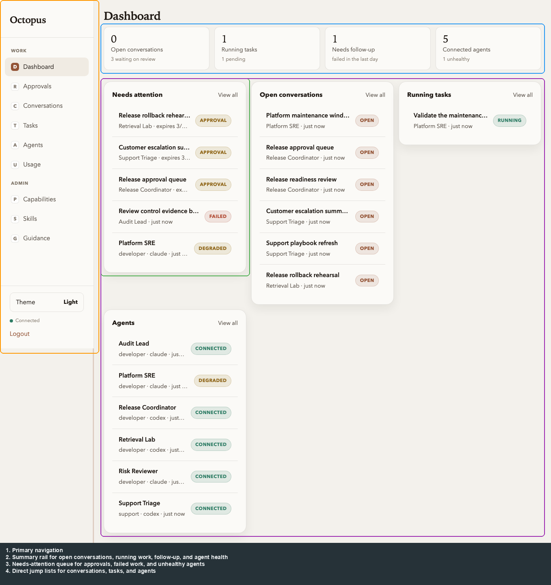

- The home screen now starts with the next operator action instead of a pure metrics wall.
- It combines **`GET /v1/summary`** with preview data from approvals, conversations, and tasks so you can see what needs attention first.

### 1b. Approvals

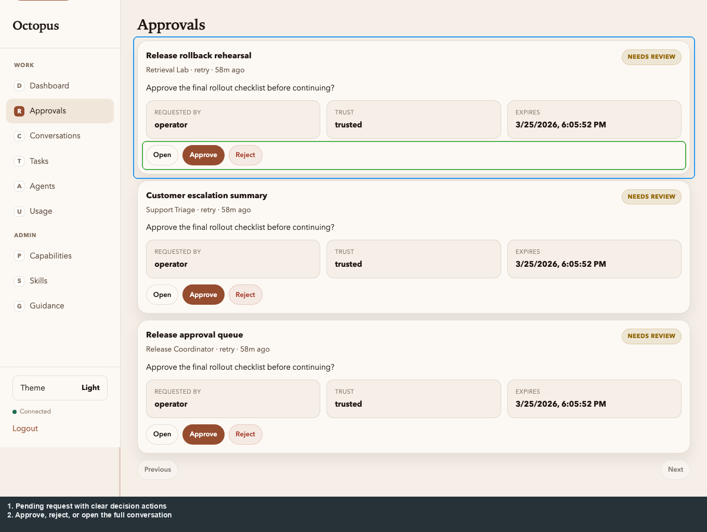

- This is the fastest path for pending decisions.
- Each card shows the request text, agent context, expiry, and direct **Approve** / **Reject** actions.

### 2. Agents list

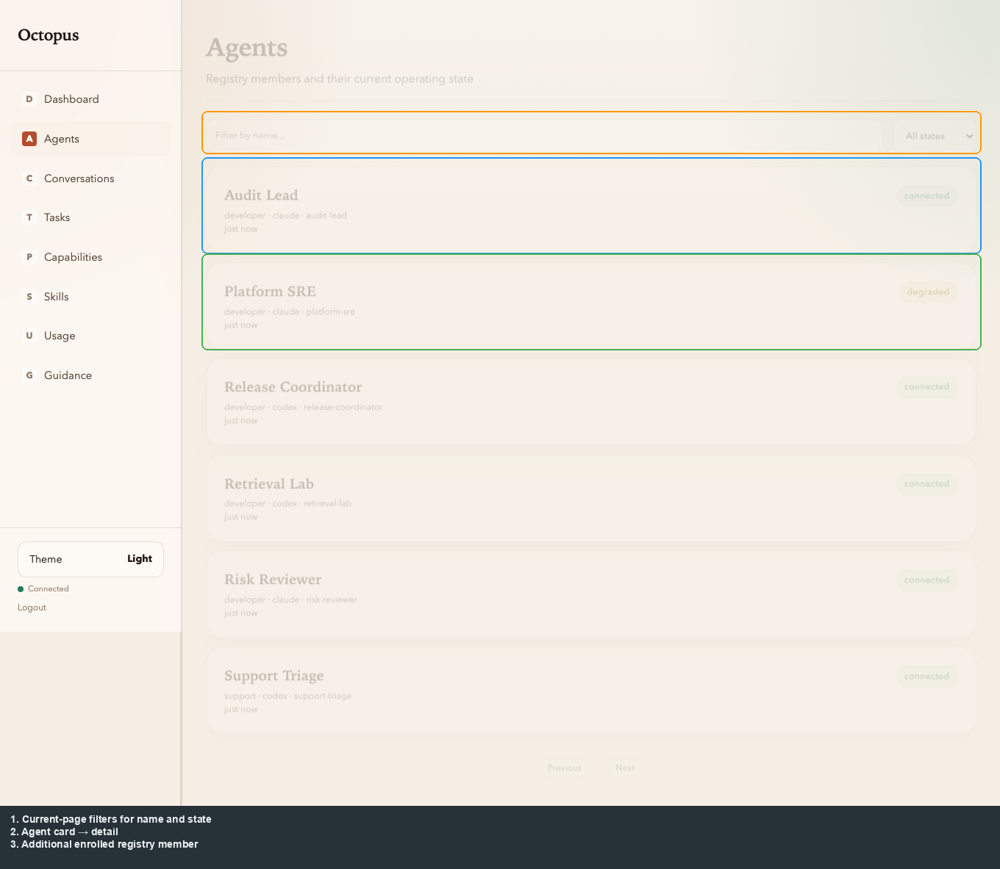

- Each **card** is one enrolled agent; **connectivity** reflects the current heartbeat state.
- The filters are **current-page** filters over the current result set.
- **Click** a card → **Agent detail**.

### 3. Agent detail

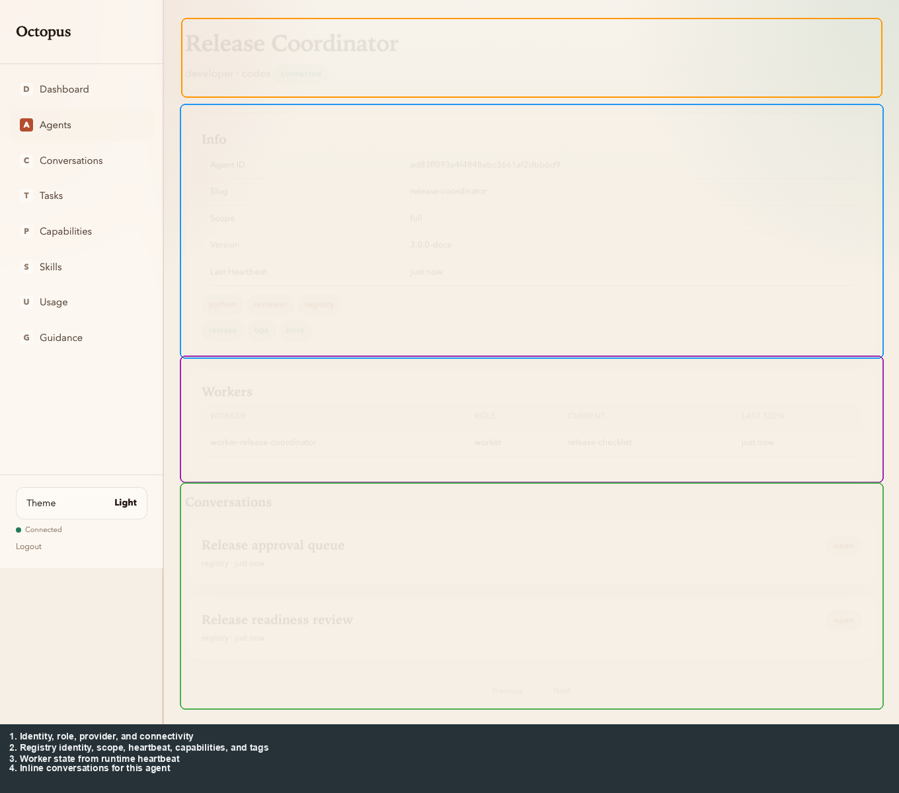

- Shows **identity**, **registry scope**, **capabilities/tags**, **heartbeat**, and optional **worker** rows when reported.
- **Conversations** for this agent appear **inline** below (paginated). The dedicated route **`/ui/agents/{id}/conversations`** shows the same scoped list in a full-page view (see §4).

### 4. Agent conversations

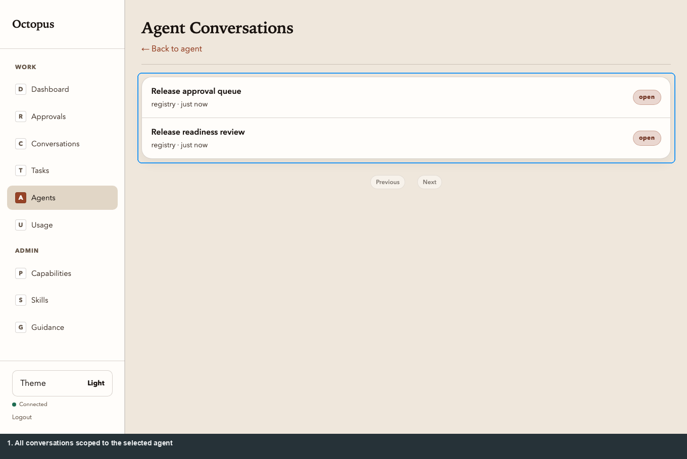

- Lists conversations involving this agent. **Click** a row → **Conversation detail**.

### 5. All conversations


- **Pagination** — Previous / Next using cursor + `has_more`.
- **Search** — type **three or more** characters (debounced); server-side `q`.
- **Status** — dropdown filter.
- **Start a conversation** creates an operator-owned registry conversation.
- **Review approvals** is the shortcut into the dedicated approvals queue.
- Click a **row** → **Conversation detail**.

### 5b. Search filter (same route)

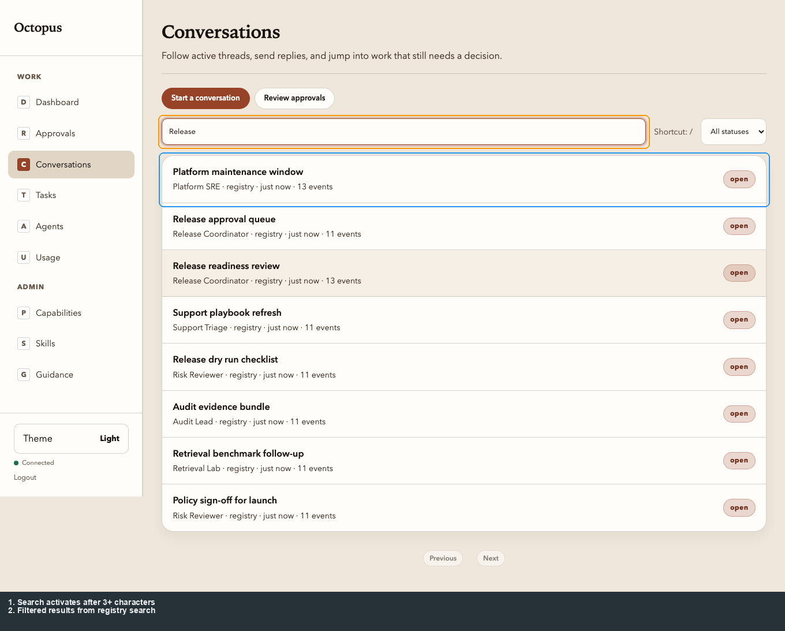

- With **3+ characters** in the search field, the list narrows (FTS-backed). The capture run uses the query **`Release`** to match synthetic conversation titles.

### 6. Conversation detail (timeline)


- **Header**: title, target display name, source, reference, and status.
- **Actions**: **Conversation** view vs **Full activity**; **Cancel** conversation; **Export** markdown.
- **Compose**: operator message (**Enter** to send); uses session cookie + CSRF.
- **Timeline**: `message.user` / `message.bot` as **bubbles**; the default view keeps approvals, delegation, task updates, and problems visible while lower-level provider/tool activity moves into **Full activity**.
- **History**: older activity loads automatically when you **scroll up** to the top sentinel.
- **Live updates**: WebSocket (`/v1/ws`) with reconnect backoff when the ASGI stack supports upgrades.

### 7. Tasks (routed tasks)

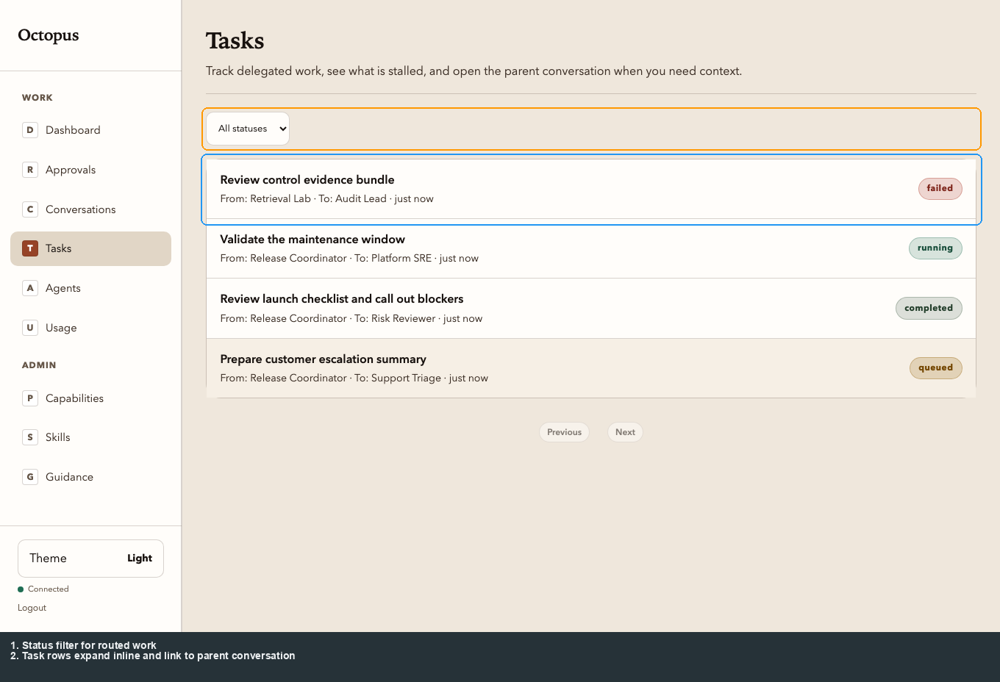

- **Pagination** and **status** filter keep task cards focused on one slice of routed work.
- Expanding a card shows instructions, result summary, and the link back to the **parent conversation**.
- Task cards refresh when routed-task updates land over the WebSocket.

### 8. Capabilities

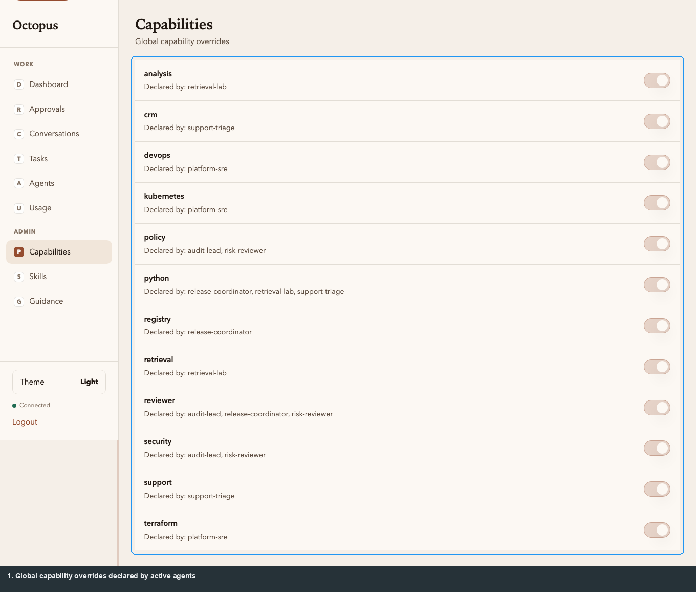

- Operator-only **global toggles** for coordination features.
- Mutations use **POST** with **CSRF** when using cookie sessions (`/v1/auth/csrf`).

### 9. Skills

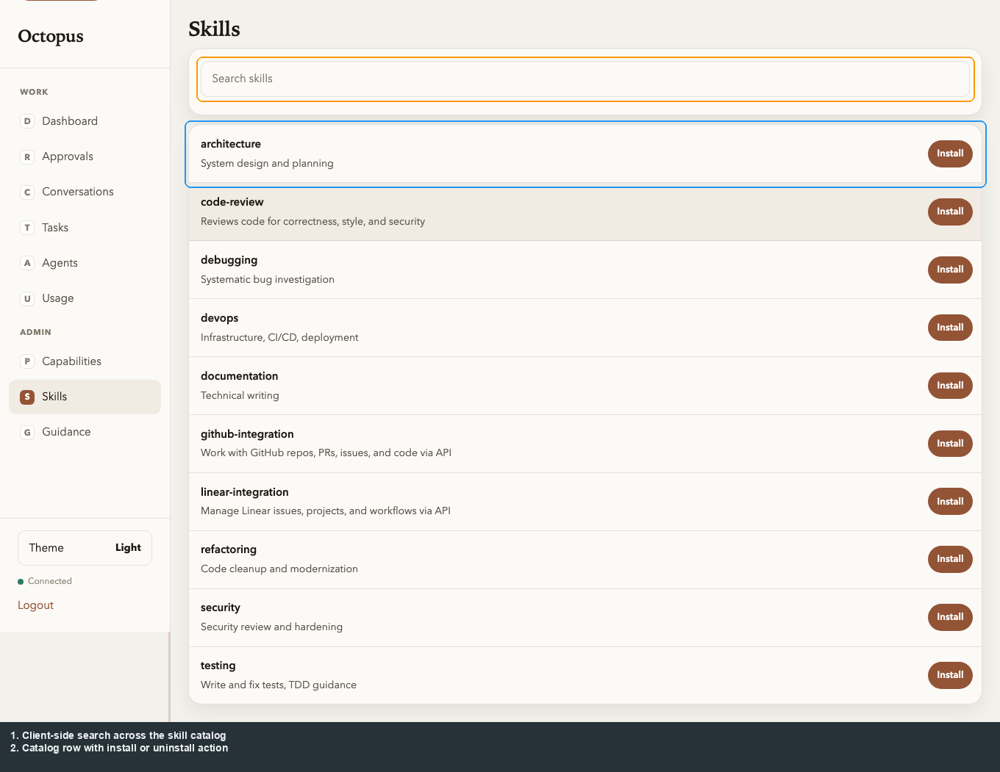

- Searchable **catalog** view backed by `/v1/catalog/skills`.
- Install / uninstall actions are available from the browser; the broader lifecycle remains API-first.

### 10. Usage

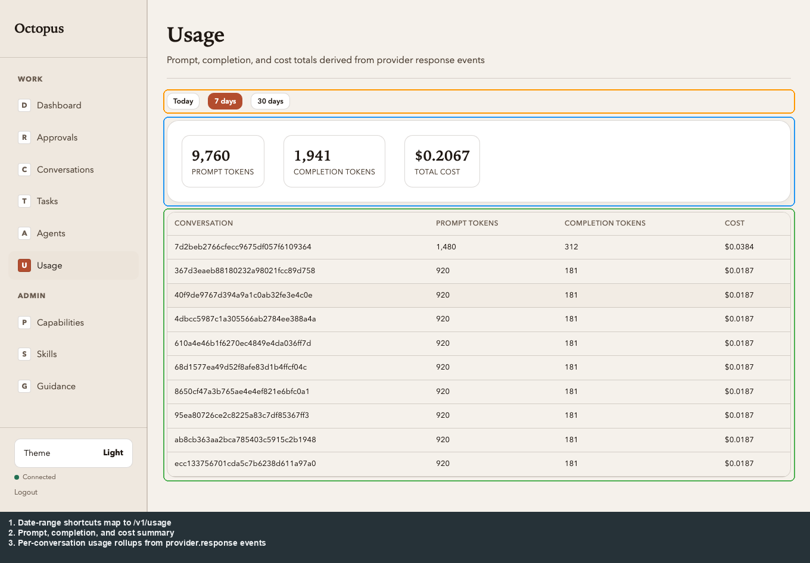

- **Today / 7 days / 30 days** buttons set `since` / `until` on `GET /v1/usage` (calendar-day boundaries for “Today”).
- Aggregated **prompt/completion tokens and cost** come from **provider response** events only.

### 11. Guidance

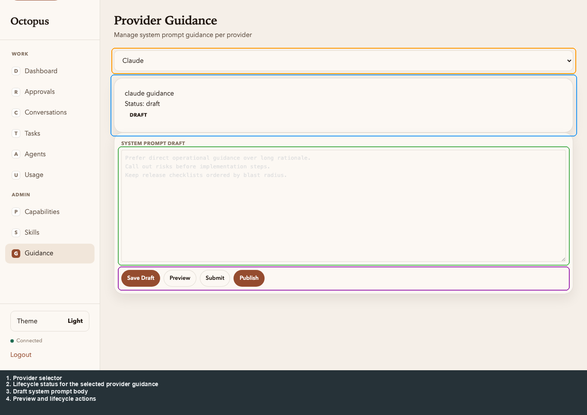

- **Provider selector** swaps between guidance surfaces such as Claude and Codex.
- The page shows **lifecycle status**, the **draft system prompt body**, and the available preview / lifecycle actions.

### 12. Direct URL to agent detail

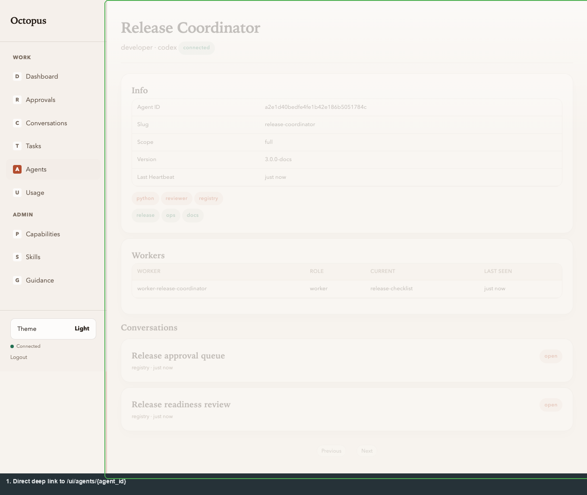

- Loading **`/ui/agents/{agent_id}`** directly (bookmark or paste) renders the same agent detail view as clicking from the list — useful when sharing links from logs or API responses.

### 13. Direct URL to conversation detail

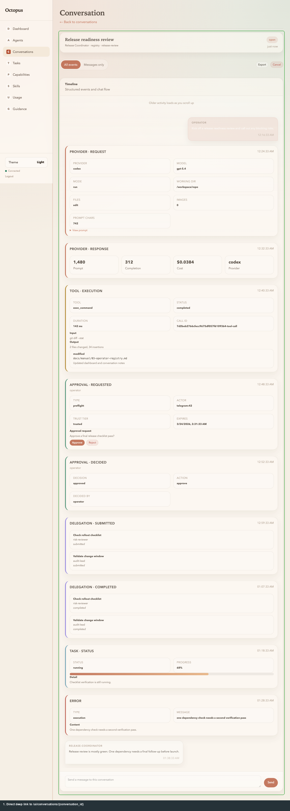

- Loading **`/ui/conversations/{conversation_id}`** directly shows the **same** conversation detail (timeline, compose, cancel, export) as choosing a row from the list — shareable from API responses or task links.

### 14. Mobile quick look

The operator UI is still the same app on mobile: the sidebar becomes a drawer, the dashboard stacks into one column, approvals stay action-first, and the conversation view keeps the reply box and pending decisions visible without forcing you through a desktop layout.

**Dashboard**


**Approvals**


**Conversation detail**


---

## What the UI does *not* do yet

| Area | Notes |
|------|--------|
| **Full skill lifecycle** | Catalog view only. Draft → submit → approve → publish flows are **API-first** (`/v1/catalog/skills/...`). |
| **Conversation-bound skill activation** | Still API-first; there is no dedicated top-level browser screen for activating or clearing skills on one conversation. |
| **Standalone approvals inbox** | Approval requests appear inside conversation timelines; there is no separate queue screen yet. |
| **WebSocket without upgrade** | Live updates need a WebSocket-capable ASGI stack. If `/v1/ws` cannot upgrade, the UI still works via **`GET …/events`** polling on navigation and manual refresh patterns. |
| **Automatic retry on 5xx** from the browser API client | Single `fetch` with timeout; optional future polish. |

---

## Verification & troubleshooting

After any registry change:

```bash
./octopus status
./octopus doctor
```

Expect: bots in **registry** mode when connected, one connection line per registry with expected `registry_id`, `scope`, state, URL; local registry **running** when using local mode.

| Symptom | Things to check |
|---------|------------------|
| UI does not load | Registry container up; port in `.deploy/registry/.env`; try `./octopus registry` → start. |
| “No agents” | Bot not enrolled or heartbeat path broken — `./octopus doctor`, reconnect bot. |
| Remote connect fails | URL must be `https://…`; enrollment token correct; scope appropriate. |
| Switch unavailable | **Switch** flows need **exactly one** registry connection — remove extras first. |

**Nuclear reset** (local dev only):

```bash
./octopus clean
```

Stops services, removes Docker volumes/networks and `.deploy/`.

---

## Regenerating UI screenshots

Annotated PNGs live under `docs/assets/registry/ui/`. **Re-run capture** after material SPA or CSS changes so guides stay aligned.

```bash
cd docs/registry-ui-screenshots
npm install
npx playwright install chromium   # once per machine
npm run capture                   # registry UI → docs/assets/registry/ui/*.png
npm run annotate                  # *-annotated.png (uses repo-root .venv)
```

The harness uses isolated tokens and a fresh throwaway DB under `docs/registry-ui-screenshots/` on every run. Usage screenshots now derive from the seeded **`provider.response`** events in the capture data; there is no separate legacy usage seeding path. **Outlines** in annotated images follow DOM positions from capture time — re-capture when layout shifts.

**Other diagrams**

- **Mermaid** (README, manual overview, ARCHITECTURE): edit the fenced blocks in the `.md` files; GitHub renders them.
- **CLI registry SVGs** (`docs/assets/registry/*.svg`): update the source that produced them, or edit SVGs directly if you own that workflow.
- **Quickstart SVGs** (`docs/assets/quickstart/`): static assets referenced from the root README.

---

## Quick reference: registry scopes

| Scope | Conversation UI / timelines | Routed tasks & discovery |
|-------|------------------------------|---------------------------|
| `full` | Yes | Yes |
| `channel` | Yes | No |
| `coordination` | No | Yes |

---

*Screenshots in this revision were generated with Playwright (Chromium) against the in-repo Registry UI; `annotate.py` adds outlines and a legend strip under the image.*
