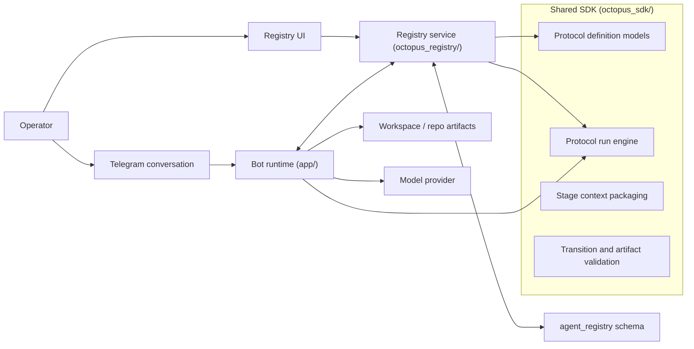

# Protocol System Plan

Status: draft  
Last updated: 2026-04-16

## 1. Problem Statement

Octopus already has solid building blocks for bots, skills, routing, delegation, registry-backed coordination, and operator control. What it does not yet have is a first-class product object for long-running, multi-stage, skill-driven work that progresses autonomously through explicit stages, review loops, and terminal acceptance.

Current limitations:

- user intent enters as a conversation, but there is no reusable protocol definition that describes how work should progress from start to completion
- skills are available as routing and behavior contracts, but there is no durable state machine that sequences skilled participants through a collaborative workflow
- review and acceptance are ad hoc rather than protocol-defined
- stage handoffs depend too much on transient provider context instead of explicit artifacts, stage state, and durable run history
- Telegram can start work, but it is not currently backed by a shared protocol engine that registry and future transports can observe and reuse
- the control plane does not yet provide protocol authoring, versioning, run inspection, or intervention

The result is that multi-agent collaboration is possible in pieces, but not yet productized as a coherent, restart-safe, inspectable, reusable system.

The objective of this project is to add a protocol system that allows operators to define collaborative workflows once and run them repeatedly against arbitrary problem statements, while preserving the current architectural rule that shared workflow logic belongs in the SDK and product clients remain thin wrappers over that logic.

## 2. Product Definition

### 2.1 Product Goal

Introduce a reusable protocol layer for autonomous collaborative work.

A protocol is a versioned definition that specifies:

- the stages of work
- the required skill or role characteristics for each stage
- the input artifacts and context required at each stage
- the outputs each stage must produce
- the review, retry, and escalation rules between stages
- the terminal acceptance rules that determine when the run is complete

A protocol run is a concrete execution of one protocol version against:

- a problem statement
- a target workspace or repository
- a specific entry bot or conversation
- optional constraints and supporting context

### 2.2 Core User Outcomes

The system must allow an operator to:

- define a protocol in the registry control plane
- version, validate, and publish the protocol
- start a protocol run from a bot conversation or the control plane
- watch the run progress through stages
- inspect artifacts, reviews, and transitions
- intervene when a run is blocked, wrong, or requires human judgment

The system must allow the runtime to:

- allocate work to the correct logical participant for each stage
- preserve role-specific session context without creating a new physical bot per stage
- carry forward artifacts and cumulative workspace state explicitly
- loop between producer and reviewer stages until acceptance criteria are met
- recover after restart without losing the canonical run state

### 2.3 Non-Goals For V1

The first implementation should not attempt to solve everything at once.

Out of scope for the first cut:

- parallel write-heavy stage execution on the same working tree
- dynamically provisioning a new first-class bot instance for every stage
- treating provider thread memory as the source of truth for run state
- inventing a second queue, second state store, or second workflow lifecycle alongside existing registry coordination
- decomposing architecture review into many separate specialist reviewers for every concern area

## 3. Product Principles

These principles constrain the implementation.

### 3.1 One Canonical Pipeline

The protocol system must extend the current SDK, registry, and runtime seams in place.

- do not create a second orchestration engine in the registry UI
- do not create Telegram-only protocol logic
- do not create a separate protocol queue family if routed-task and control-plane envelopes can be extended
- do not duplicate state across repo files and database tables

### 3.2 Canonical State In The Control Plane

Protocol definitions and protocol runs are control-plane objects.

- canonical protocol definition state belongs in registry-backed storage
- canonical protocol run state belongs in registry-backed storage
- repo files are workflow artifacts, not the state machine itself
- chat history is an invocation and notification surface, not the authoritative workflow ledger

### 3.3 Shared Workflow Logic In The SDK

All transition validation, review-loop rules, participant session derivation, artifact contract validation, and run progression logic belongs in `octopus_sdk/`.

Registry and Telegram must call the same shared behavior.

### 3.4 Explicit Context Over Hidden Memory

Participants must receive the context they need through:

- the current stage definition
- the protocol run state
- the artifact manifest
- explicit workspace references
- prior review output and acceptance criteria

They must not rely on provider-native memory as the canonical coordination mechanism.

### 3.5 Logical Participants, Not Duplicate Physical Bots

The system should support many logical participants hosted by one physical runtime.

A planner, reviewer, architect, implementer, and acceptance agent can all be represented as distinct protocol participants with distinct session keys, while still running on the same underlying bot runtime if desired.

## 4. End-To-End Architecture

The protocol system should fit cleanly into the existing package boundaries documented in [docs/ARCHITECTURE.md](/Users/tinker/output/bots/telegram-agent-bot/docs/ARCHITECTURE.md).



### 4.1 Responsibility Split

`octopus_sdk/` owns:

- protocol definition schema and validation
- protocol run state machine
- participant session-key derivation
- transition rules
- artifact contract rules
- stage input packaging
- review-loop semantics
- acceptance and terminal semantics

`octopus_registry/` owns:

- protocol definition persistence and versioning
- protocol run persistence and projection
- protocol APIs
- protocol designer UI
- protocol run inspection and intervention APIs
- realtime projection of run progress

`app/` owns:

- Telegram invocation into the protocol engine
- runtime execution of stage work using existing bot execution flows
- notifications back to Telegram conversations
- provider integration and workspace execution

## 5. Protocol Domain Model

The product needs two primary objects and a small set of supporting records.

### 5.1 `ProtocolDefinition`

`ProtocolDefinition` is the reusable template.

It should include:

- identity: `protocol_id`, `slug`, `display_name`, `description`
- lifecycle: `draft | published | archived`
- version metadata
- participant definitions
- stage graph
- artifact definitions
- transition rules
- review-loop policy
- acceptance policy
- optional default prompt templates for stages
- optional registry-scoped visibility and ownership metadata

Each published version should be immutable.

The canonical definition body should be stored as one validated versioned document rather than scattering stage structure across many partially duplicated tables. Relational tables can index metadata, but the versioned definition document should remain the source of truth for the protocol graph.

### 5.2 `ProtocolRun`

`ProtocolRun` is one concrete execution of a protocol version.

It should include:

- identity: `run_id`
- linkage to `protocol_definition_version_id`
- entry agent and authority references
- root conversation reference
- origin channel
- workspace and repository references
- problem statement
- optional constraint references
- run status
- current stage execution reference
- timestamps
- termination summary

### 5.3 `ProtocolParticipant`

A participant is a logical worker within a protocol run.

It should include:

- `participant_key`
- display label
- required skills or role constraints
- target selection policy
- resolved execution target
- stable session key
- current lifecycle state

Participants are logical run-scoped identities. They are not separate product-level bots.

### 5.4 `ProtocolStageDefinition`

A stage definition should include:

- `stage_key`
- human-readable name
- assigned `participant_key`
- expected input artifacts
- output artifacts
- acceptance checks
- allowed transitions
- whether the stage is read-only or write-capable
- whether it is a review stage
- retry and timeout policy

### 5.5 `ProtocolStageExecution`

A stage execution is one attempted pass through one stage.

It should include:

- `stage_execution_id`
- `run_id`
- `stage_key`
- `participant_key`
- stage attempt number
- loop iteration number
- lifecycle state
- input snapshot reference
- output summary
- linked routed-task reference when applicable
- failure metadata
- timestamps

### 5.6 `ProtocolArtifact`

Artifacts are durable outputs or inputs referenced by the protocol.

They should include:

- `artifact_id`
- `run_id`
- `artifact_key`
- artifact kind
- canonical URI or workspace path
- producing stage execution
- content hash
- lifecycle state
- supersession linkage

Artifacts may point to:

- files in the repo
- generated summaries or structured payloads stored in the control plane
- external references if the protocol explicitly allows them

### 5.7 `ProtocolTransition`

A transition is the durable record of why the run moved from one stage execution to another.

It should include:

- source stage execution
- destination stage execution
- transition kind
- decision reason
- actor type
- actor reference
- timestamp

## 6. Definition Shape

The versioned definition body should be explicit enough for SDK validation and registry authoring, but compact enough to avoid duplicate representations.

Illustrative shape:

```json
{
  "metadata": {
    "slug": "software-engineering",
    "display_name": "Software Engineering",
    "description": "Plan, review, architect, implement, review, accept"
  },
  "participants": {
    "planner": {
      "display_name": "Planner",
      "required_skills": ["product-definition"]
    },
    "plan_reviewer": {
      "display_name": "Plan Reviewer",
      "required_skills": ["review"]
    }
  },
  "artifacts": {
    "problem": {
      "kind": "workspace_file",
      "path": "protocol/problem.md"
    },
    "plan": {
      "kind": "workspace_file",
      "path": "protocol/plan.md"
    }
  },
  "stages": [
    {
      "stage_key": "planning",
      "participant_key": "planner",
      "inputs": ["problem"],
      "outputs": ["plan"],
      "transitions": {
        "accepted": "architecture",
        "needs_review": "plan_review"
      }
    }
  ],
  "policies": {
    "writer_mode": "single_active_writer",
    "max_review_rounds": 5
  }
}
```

This document should be the validated canonical protocol definition for one version. Registry UI can edit it through structured forms, but the SDK should validate the same definition regardless of entry point.

## 7. Execution Model

### 7.1 Invocation

A run begins when an operator or client supplies:

- the target protocol
- the problem statement
- the workspace or repo reference
- the entry bot or conversation context
- optional protocol-specific constraints

The system creates:

- one `ProtocolRun`
- the initial artifact set required by the protocol
- the initial stage execution
- the participant session records needed for the run

### 7.2 Participant Session Isolation

Every logical participant must have a stable session key derived from:

- `protocol_run_id`
- `participant_key`

Illustrative form:

`protocol:<run_id>:participant:<participant_key>`

This allows one physical bot runtime to host many logical workers while preserving distinct role-specific context and avoiding contamination between planner, reviewer, architect, and implementer threads.

### 7.3 Stage Dispatch

The system should not invent a second execution stack for protocol work.

Instead:

- reuse the existing runtime execution pipeline for stage execution
- extend routed-task or existing control-plane payloads with protocol context when inter-agent dispatch is required
- for work handled by the current runtime, enter the same execution pipeline with the participant session key and stage context rather than building a new worker path

Required protocol context on each stage dispatch:

- `protocol_run_id`
- `stage_execution_id`
- `participant_key`
- `protocol_definition_version_id`
- current artifact manifest
- workspace reference
- acceptance rubric
- prior review feedback that remains relevant

### 7.4 Review Loops

Review loops are protocol-defined, not ad hoc.

The basic loop shape is:

1. producer stage executes
2. reviewer stage evaluates against the problem statement, current artifacts, and stage criteria
3. reviewer either accepts or rejects
4. on rejection, the producer receives explicit review output and produces a revised artifact or workspace change
5. loop continues until accepted or the protocol escalates due to a max-round or timeout policy

### 7.5 Acceptance

Acceptance is a terminal control point, not just another reviewer message.

The acceptance participant should be able to:

- accept the run and mark it complete
- route back to an earlier stage with explicit reasons
- terminate the run as failed or blocked

### 7.6 Workspace Mutation Policy

The first implementation should use one active writer at a time.

- write-capable stages acquire a run-scoped lease
- review stages are read-heavy by default
- the active writer stage mutates the shared workspace
- if later parallel implementation is added, it must use isolated branches or worktrees, not uncontrolled concurrent edits in one working tree

### 7.7 Restart Safety

Protocol continuation must not depend on live provider memory or uninterrupted bot uptime.

After a restart, the runtime must be able to resume the next stage from:

- the canonical run state in the control plane
- the stage history
- the participant session key
- the durable artifact manifest

## 8. Reuse Of Existing System Seams

This project should extend the existing system, not build around it.

### 8.1 SDK Reuse

The protocol engine should build on the same principles already used for delegation and workflow progression in [octopus_sdk/workflows/delegation.py](/Users/tinker/output/bots/telegram-agent-bot/octopus_sdk/workflows/delegation.py).

Reuse strategy:

- extend SDK-owned workflow models and progression helpers
- reuse session persistence and provider-state management
- reuse registry authority and task-routing adapters
- reuse execution finalization and progress publication hooks

### 8.2 Registry Reuse

The control plane already has:

- typed command envelopes in [app/control_plane/models.py](/Users/tinker/output/bots/telegram-agent-bot/app/control_plane/models.py)
- routed task models in [octopus_sdk/registry/models.py](/Users/tinker/output/bots/telegram-agent-bot/octopus_sdk/registry/models.py)
- registry-backed task persistence and delivery

Reuse strategy:

- keep protocol definitions and runs in `agent_registry`
- reuse existing delivery and coordination channels wherever stage work needs remote execution
- reuse registry realtime projection for run updates

### 8.3 Transport Reuse

Telegram should remain a thin invocation and notification client.

Reuse strategy:

- use existing conversation entry and runtime execution wiring
- add protocol-specific start, progress, and intervention plumbing only where necessary
- avoid Telegram-only protocol logic that other clients would later need to duplicate

## 9. Data Model Plan

The data model should be explicit but not over-normalized.

Protocol definitions and runs belong in the existing `agent_registry` schema family.

### 9.1 Tables

#### `protocol_definitions`

Purpose: stable identity and lifecycle for a protocol.

Suggested fields:

- `protocol_id`
- `slug`
- `display_name`
- `description`
- `lifecycle_state`
- `current_version_id`
- `created_by`
- `created_at`
- `updated_at`

#### `protocol_definition_versions`

Purpose: immutable versioned definition body.

Suggested fields:

- `protocol_definition_version_id`
- `protocol_id`
- `version`
- `definition_json`
- `content_hash`
- `validation_status`
- `published_at`
- `created_at`

This table should be the source of truth for the actual stage graph and participant structure.

#### `protocol_runs`

Purpose: one concrete protocol execution.

Suggested fields:

- `protocol_run_id`
- `protocol_definition_version_id`
- `entry_agent_id`
- `entry_authority_ref`
- `root_conversation_id`
- `origin_channel`
- `workspace_ref`
- `repo_ref`
- `branch_ref`
- `problem_statement`
- `constraints_json`
- `status`
- `current_stage_execution_id`
- `termination_summary`
- `created_at`
- `updated_at`
- `completed_at`

#### `protocol_run_participants`

Purpose: resolved logical workers for one run.

Suggested fields:

- `protocol_run_participant_id`
- `protocol_run_id`
- `participant_key`
- `display_name`
- `required_skills_json`
- `target_selector_json`
- `resolved_agent_id`
- `resolved_authority_ref`
- `session_key`
- `state`
- `created_at`
- `updated_at`

#### `protocol_stage_executions`

Purpose: one attempted execution of one stage.

Suggested fields:

- `protocol_stage_execution_id`
- `protocol_run_id`
- `stage_key`
- `participant_key`
- `attempt`
- `loop_iteration`
- `status`
- `input_snapshot_json`
- `output_summary`
- `lease_owner`
- `lease_expires_at`
- `routed_task_id`
- `failure_code`
- `failure_detail`
- `started_at`
- `completed_at`

#### `protocol_artifacts`

Purpose: durable artifact manifest for one run.

Suggested fields:

- `protocol_artifact_id`
- `protocol_run_id`
- `artifact_key`
- `artifact_kind`
- `location`
- `workspace_path`
- `content_hash`
- `produced_by_stage_execution_id`
- `state`
- `supersedes_artifact_id`
- `created_at`

#### `protocol_transitions`

Purpose: durable transition history.

Suggested fields:

- `protocol_transition_id`
- `protocol_run_id`
- `from_stage_execution_id`
- `to_stage_execution_id`
- `transition_kind`
- `decision`
- `reason`
- `actor_type`
- `actor_ref`
- `created_at`

### 9.2 What Not To Add

Do not add:

- a second protocol-specific delivery queue if existing routed-task or command delivery can be extended
- a second canonical event log when existing registry events and protocol transition records are sufficient
- repo-file polling as canonical state progression

## 10. API Plan

Registry should expose one coherent API family for protocol authoring and execution.

### 10.1 Protocol Definition APIs

Suggested endpoints:

- `GET /v1/protocols`
- `POST /v1/protocols`
- `GET /v1/protocols/{protocol_id}`
- `GET /v1/protocols/{protocol_id}/versions`
- `GET /v1/protocols/{protocol_id}/versions/{version_id}`
- `PUT /v1/protocols/{protocol_id}/draft`
- `POST /v1/protocols/{protocol_id}/validate`
- `POST /v1/protocols/{protocol_id}/publish`
- `POST /v1/protocols/{protocol_id}/archive`

Behavior:

- draft updates write one editable working definition
- publish creates an immutable version after SDK validation
- validate uses the same SDK rules used by runtime execution

### 10.2 Protocol Run APIs

Suggested endpoints:

- `GET /v1/protocol-runs`
- `POST /v1/protocol-runs`
- `GET /v1/protocol-runs/{run_id}`
- `GET /v1/protocol-runs/{run_id}/participants`
- `GET /v1/protocol-runs/{run_id}/artifacts`
- `GET /v1/protocol-runs/{run_id}/timeline`

`POST /v1/protocol-runs` should accept:

- `protocol_id` or `protocol_definition_version_id`
- `entry_agent_id`
- `root_conversation_ref`
- `workspace_ref`
- `problem_statement`
- `constraints_json`

### 10.3 Operator Action APIs

Suggested endpoints:

- `POST /v1/protocol-runs/{run_id}/pause`
- `POST /v1/protocol-runs/{run_id}/resume`
- `POST /v1/protocol-runs/{run_id}/cancel`
- `POST /v1/protocol-runs/{run_id}/retry`
- `POST /v1/protocol-runs/{run_id}/accept`
- `POST /v1/protocol-runs/{run_id}/send-back`

These actions should become typed control-plane operations, not ad hoc UI-side mutations.

### 10.4 Stage Dispatch Payloads

Where stage work is dispatched through existing coordination channels, extend the current payloads with protocol metadata instead of inventing a new task family.

Required fields:

- `protocol_run_id`
- `protocol_stage_execution_id`
- `participant_key`
- `session_key`
- `artifact_manifest`
- `workspace_ref`
- `acceptance_criteria`
- `review_feedback`

## 11. Registry UI Plan

Protocol designer and run inspection belong in the registry control plane.

### 11.1 Protocol Catalog

The registry should provide:

- a protocol list
- protocol detail pages
- version history
- lifecycle actions for draft, publish, and archive

### 11.2 Protocol Designer

The designer should edit one canonical protocol definition.

Recommended sections:

- Overview
- Participants
- Artifacts
- Stages
- Transitions
- Policies
- Validation

The designer should not invent a second client-side protocol model. It should edit the same definition structure that the SDK validates and the registry stores.

### 11.3 Run Detail View

The run detail page should show:

- current run status
- current stage
- participant list
- artifact manifest
- transition timeline
- review loop history
- operator actions

### 11.4 Registry Projection Rules

Run pages should project canonical control-plane state.

They should not infer run status from chat text or transient provider output.

## 12. Telegram Integration Plan

Telegram is the first invocation and notification surface, not the orchestration engine.

Telegram responsibilities:

- start a protocol run against the current bot and workspace context
- show progress updates, waiting states, failures, and completion
- surface minimal intervention actions when appropriate

Telegram should not own:

- protocol definition validation
- transition rules
- review-loop semantics
- canonical run storage

The Telegram implementation should call into the same SDK protocol engine and registry-backed protocol APIs that every other client will rely on.

## 13. Initial Software Engineering Protocol

The first built-in protocol should model a practical end-to-end software workflow while staying small enough to validate the engine.

### 13.1 Participants

- `planner`
- `plan_reviewer`
- `architect`
- `architecture_reviewer`
- `implementer`
- `implementation_reviewer`
- `acceptance`

### 13.2 Default Artifact Set

To minimize duplication while preserving durable context, the initial artifact set should be compact:

- `protocol/problem.md`
  captures the invoked problem statement and any fixed constraints
- `protocol/plan.md`
  captures requirements, feasibility, architecture, and implementation guidance
- `protocol/status.md`
  captures implementation progress, completed slices, outstanding work, and final outcome

Review outputs should be canonical in protocol stage execution records and may optionally be materialized into repo files if the protocol definition explicitly requires repo-visible review artifacts.

### 13.3 Stage Sequence

| Stage | Participant | Inputs | Primary Outputs | Exit Condition |
|------|-------------|--------|-----------------|----------------|
| `planning` | `planner` | problem | plan | plan ready for review |
| `plan_review` | `plan_reviewer` | problem, plan | review decision | accepted or sent back |
| `architecture` | `architect` | problem, accepted plan | updated plan | architecture ready for review |
| `architecture_review` | `architecture_reviewer` | problem, plan | review decision | accepted or sent back |
| `implementation` | `implementer` | problem, plan, status | code changes, updated status | component slice ready for review |
| `implementation_review` | `implementation_reviewer` | problem, plan, status, workspace | review decision | accepted, sent back, or escalated |
| `acceptance` | `acceptance` | full artifact set and workspace | terminal decision | complete, failed, or returned |

### 13.4 Review Criteria

The architecture review rubric should cover:

- data model
- API shape
- component boundaries
- security
- reliability
- observability
- logging
- maintainability
- reuse of existing components instead of duplicate implementations

The implementation review rubric should cover:

- correctness against the problem statement
- adherence to the architecture and implementation guide
- unnecessary duplication
- test quality and test relevance
- workspace cohesion across cumulative changes

### 13.5 Loop Semantics

- `planning` loops with `plan_review` until accepted
- `architecture` loops with `architecture_review` until accepted
- `implementation` loops with `implementation_review` until the defined slice is accepted
- `acceptance` can route back to architecture or implementation if the cumulative result is not acceptable

## 14. Implementation Plan

Implementation should proceed in phases that preserve one coherent path.

### Phase 1: Domain Modeling In The SDK

Add SDK-owned protocol models and validation:

- definition schema
- run schema
- participant schema
- artifact schema
- transition schema
- validation helpers

Deliverables:

- SDK domain models
- definition validator
- transition validator
- test coverage for schema and transition rules

### Phase 2: Protocol Engine In The SDK

Add the run progression engine:

- create run
- create initial artifacts
- derive participant session keys
- create stage executions
- apply transitions
- enforce single-active-writer policy
- enforce review-loop and acceptance policies

Deliverables:

- run progression service
- stage context packager
- restart-safe progression tests

### Phase 3: Registry Persistence And APIs

Add registry persistence and API coverage:

- definition storage
- version storage
- run storage
- artifact manifest storage
- transition history
- operator action endpoints

Deliverables:

- schema migrations
- store-layer support
- API handlers
- protocol API tests

### Phase 4: Runtime Integration

Connect protocol stage execution to the current runtime without building a second worker system:

- invoke the existing execution pipeline with participant session keys
- extend routed-task or control-plane payloads for protocol stage context where needed
- project progress back into run state

Deliverables:

- runtime adapters
- progress and completion hooks
- local-versus-remote execution parity tests

### Phase 5: Telegram Integration

Add Telegram support as a client surface:

- start protocol runs
- receive progress notifications
- surface terminal outcomes
- expose operator-safe intervention hooks

Deliverables:

- Telegram invocation adapter
- progress rendering
- end-to-end tests through Telegram entry

### Phase 6: Registry UI

Add protocol authoring and inspection in the control plane:

- catalog
- designer
- validation feedback
- run detail and timeline
- artifact inspection
- operator actions

Deliverables:

- UI pages
- API integration
- UI contract tests

### Phase 7: First Protocol And Hardening

Implement and validate the software engineering protocol:

- publish the first protocol definition
- test review loops
- test failure and recovery
- test restart continuity

Deliverables:

- first published protocol
- seeded artifacts
- end-to-end protocol run tests

## 15. Testing Plan

Testing must protect the shared invariants, not just isolated UI behavior.

### 15.1 SDK Tests

- definition validation
- transition validation
- review-loop rules
- acceptance behavior
- participant session-key derivation
- single-active-writer enforcement

### 15.2 Registry Tests

- definition CRUD and versioning
- run creation
- transition persistence
- artifact manifest behavior
- operator actions
- realtime projection correctness

### 15.3 Runtime Tests

- stage execution through the existing runtime pipeline
- protocol context injection into stage execution
- routed-task reuse when protocol work crosses agent boundaries
- restart and resume behavior

### 15.4 Telegram Tests

- protocol run creation from Telegram
- progress notification rendering
- completion and failure reporting

### 15.5 End-To-End Tests

- happy path through the full software engineering protocol
- rejected review loops
- acceptance send-back to an earlier stage
- bot restart during an active run
- registry UI and Telegram remaining in sync

## 16. Risks And Mitigations

### 16.1 Provider Variance

Risk:
stage quality varies by provider and model.

Mitigation:
the protocol engine must not depend on provider-native workflow semantics. It should depend on explicit artifacts, stage criteria, and review loops.

### 16.2 Review Oscillation

Risk:
producer and reviewer can loop indefinitely.

Mitigation:
enforce max review rounds, timeout policy, and acceptance-stage escalation.

### 16.3 Workspace Conflicts

Risk:
multiple participants corrupt the working tree.

Mitigation:
start with a single active writer policy and make reviewers read-heavy by default.

### 16.4 Duplicate Lifecycle Drift

Risk:
registry, Telegram, and runtime each implement slightly different protocol rules.

Mitigation:
all lifecycle rules and validation live in the SDK and are called by every surface.

### 16.5 State Duplication

Risk:
repo files, chat text, and database state drift apart.

Mitigation:
store canonical run state in the control plane, treat repo files as artifacts, and treat chat as a view over the run.

## 17. Acceptance Criteria

The project is complete when the following are true:

- a protocol can be defined, validated, versioned, and published in the registry
- a protocol run can be started from Telegram and observed in the registry
- stage progression is driven by one SDK-owned state machine
- logical participants have isolated session keys without requiring separate physical bots
- one run survives bot restart without losing canonical state
- the first software engineering protocol completes end to end with review loops and terminal acceptance
- the implementation does not introduce duplicate workflow engines, duplicate state stores, or duplicate product models

## 18. Immediate Next Steps

The next concrete steps are:

1. write the SDK protocol domain models and validator
2. add the registry persistence schema and definition/run APIs
3. implement the SDK run progression engine
4. wire runtime stage execution through existing execution paths
5. add registry designer and run views
6. seed and validate the first software engineering protocol
